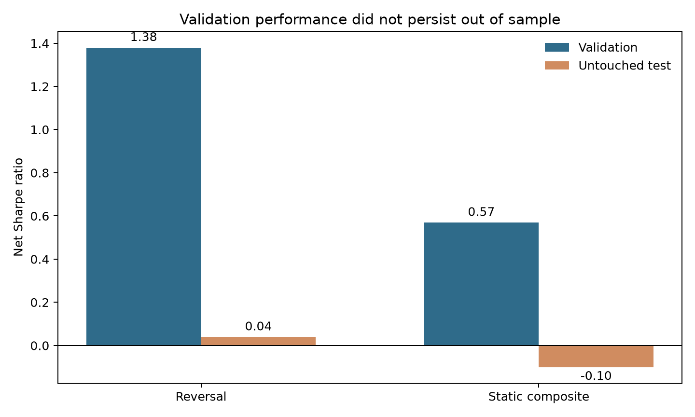
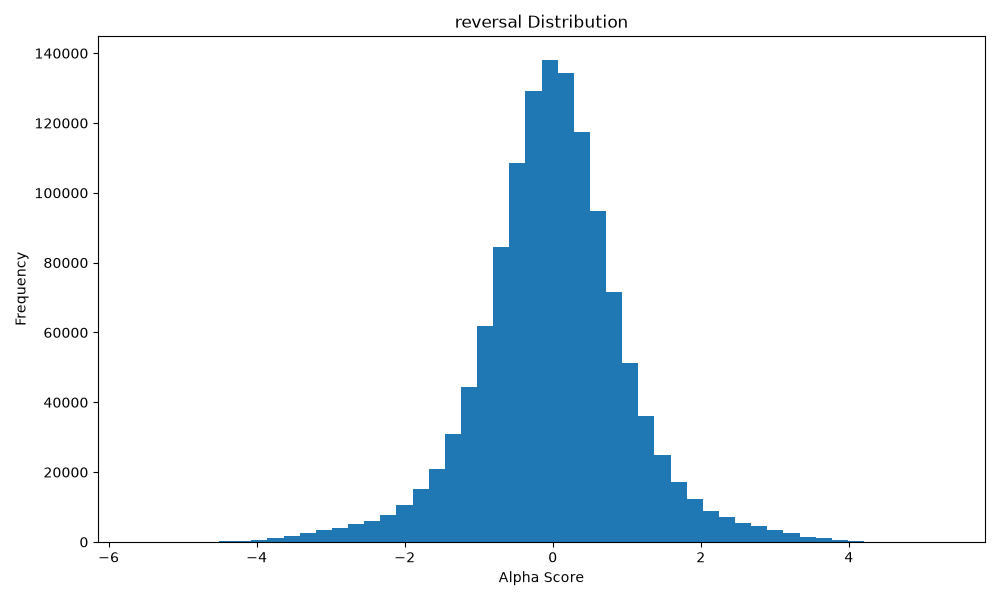
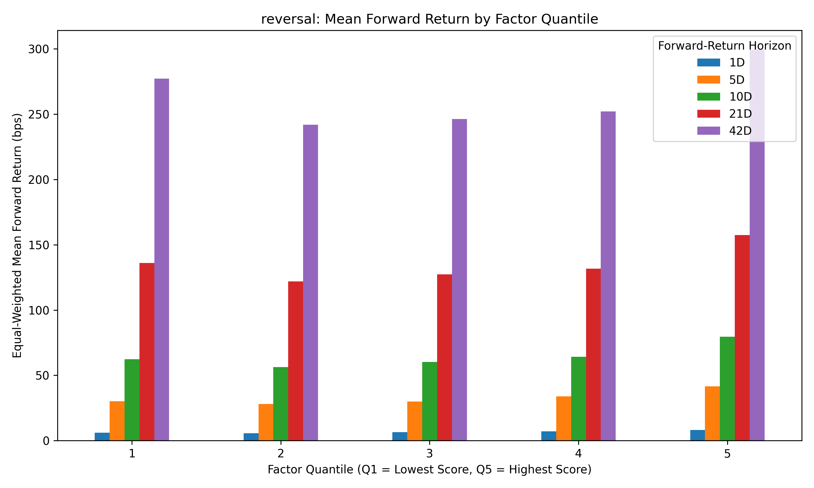
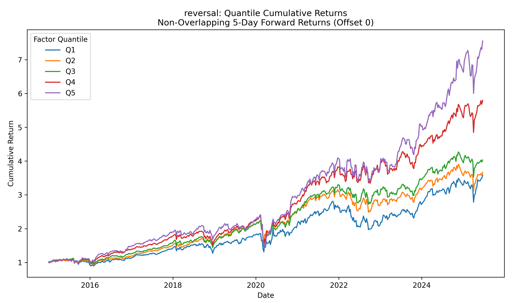
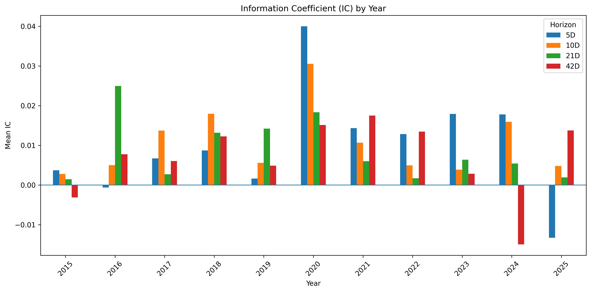
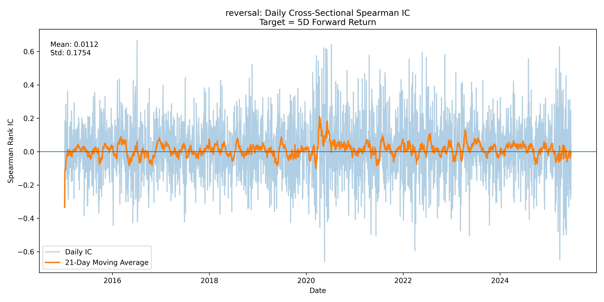
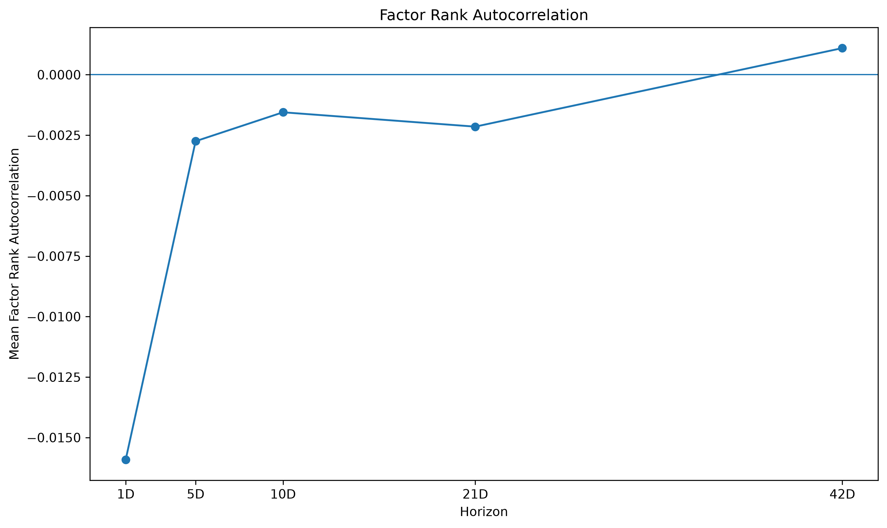
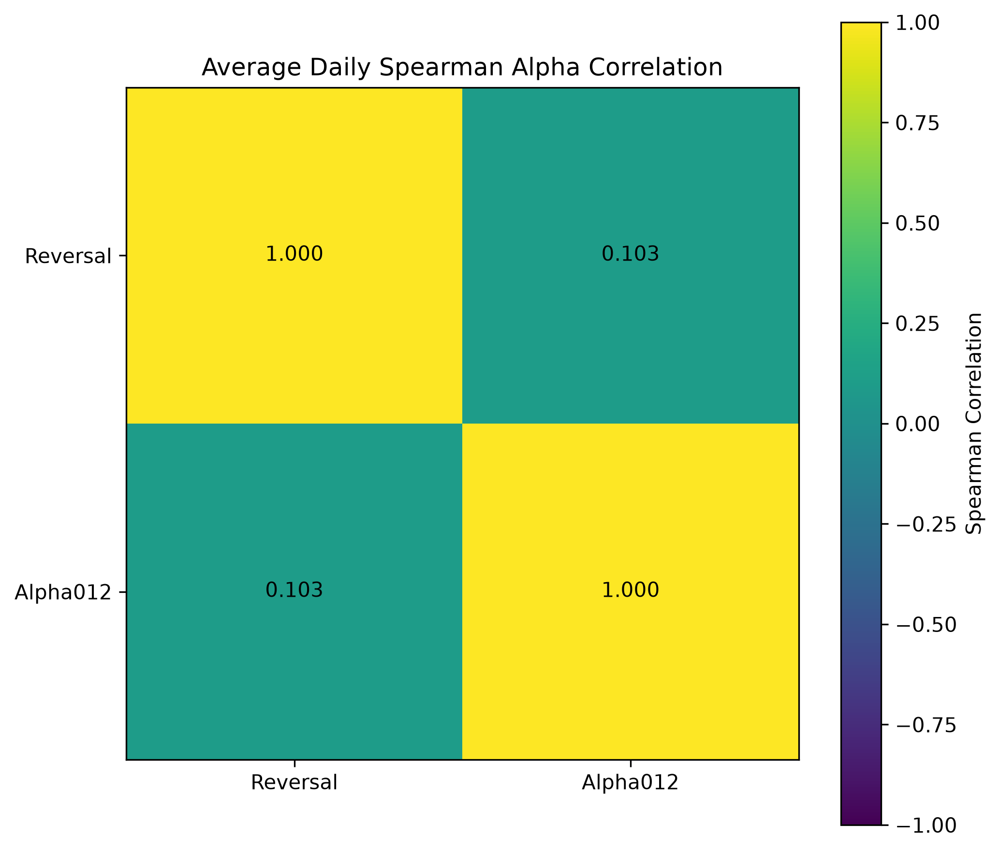
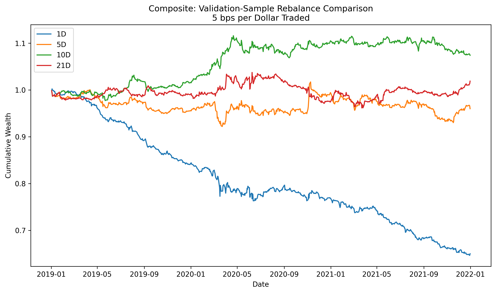
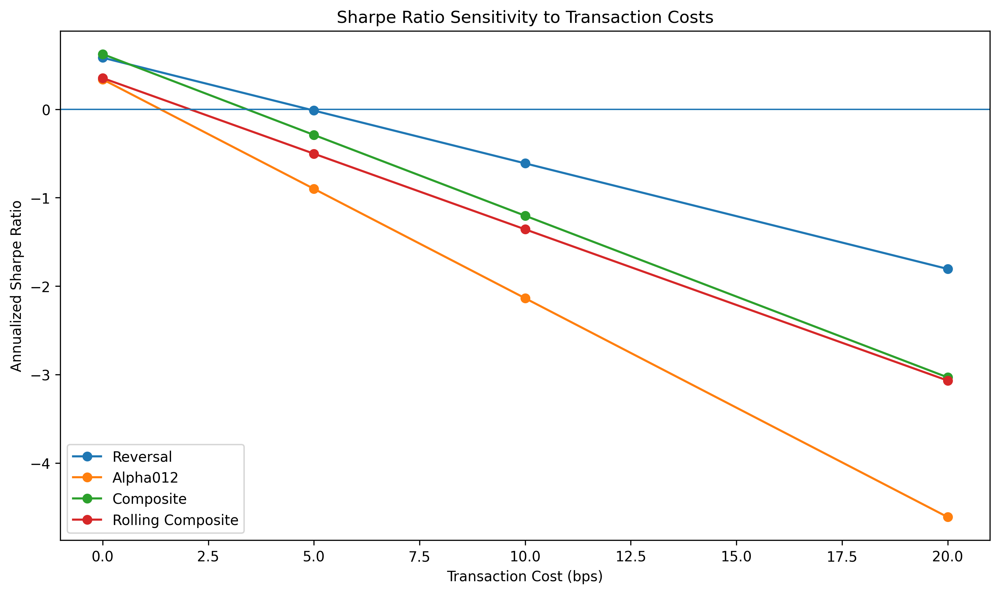

# Systematic Alpha Research

[](https://www.python.org/)
[](https://docs.astral.sh/ruff/)

This is a systematic equity research project that tests whether cross-sectional price-volume signals remain useful after executable timing, portfolio turnover, transaction costs, and out-of-sample evaluation. The signals show weak statistical predictability, but their portfolio performance does not remain stable in the historical evaluation period.

The committed case study uses current S&P 500 constituents and therefore contains survivorship bias. Its results demonstrate the research pipeline and should not be interpreted as an unbiased historical investment claim. The code also supports point-in-time membership data for a more defensible evaluation.

## Main Result

In the survivorship-biased demonstration, at 5 basis points per dollar traded, the reversal strategy's net Sharpe falls from 1.38 in validation to 0.04 in the historical evaluation period. The static composite falls from 0.57 to -0.10.

| Strategy         | Sample                | Rebalance | Daily Turnover | Gross Sharpe | Net Sharpe | Net Annualized Return |
| ---------------- | --------------------- | --------: | -------------: | -----------: | ---------: | --------------------: |
| Reversal         | Validation            |       10D |          0.154 |         1.61 |       1.38 |                12.15% |
| Reversal         | Historical evaluation |       10D |          0.155 |         0.27 |       0.04 |   Approximately 0.00% |
| Static composite | Validation            |       10D |          0.145 |         0.99 |       0.57 |                 2.40% |
| Static composite | Historical evaluation |       10D |          0.147 |         0.30 |      -0.10 |                -0.57% |



The deterioration is the main finding. A positive IC or validation Sharpe is not sufficient evidence of durable economic value.

## Research Design

| Period                   | Role                  | Permitted Use                  |
| ------------------------ | --------------------- | ------------------------------ |
| 2015-01-01 to 2018-12-31 | Training              | Estimate static factor weights |
| 2019-01-01 to 2021-12-31 | Validation            | Select one rebalance frequency |
| 2022-01-01 to 2025-07-01 | Historical evaluation | Evaluate frozen choices        |

The final period is called a historical evaluation rather than an untouched test because it has already been inspected. Data after July 2025 are reserved for prospective evaluation.

Signals are observed after the close on day `t`. Positions enter at the adjusted open on `t+1`, and returns are measured from the open on `t+1` to the open on `t+2`.

```text
Close(t)     Signal becomes observable
Open(t+1)    Position enters
Open(t+2)    One-day return is realized
```

Prices are joined on exact security-date keys using a shared market calendar. Missing quotes produce missing labels rather than longer holding periods. Labels crossing sample boundaries are removed.

## Signals

| Signal          |        Horizon | Interpretation                                    |
| --------------- | -------------: | ------------------------------------------------- |
| Reversal        |          1 day | Short-term close-to-close mean reversion          |
| Alpha012 robust |          1 day | Reversal conditioned on volume direction          |
| Alpha101        |       Intraday | Directional close location within the daily range |
| Alpha52 robust  | 20 to 240 days | Momentum with low-price and volume confirmation   |

Signals are winsorized by date and standardized across the eligible universe. Alpha012 and Alpha52 use scale-aware adaptations so arbitrary price rescaling does not change their rankings.



## Cross-Sectional Evidence

Mean full-sample rank IC is 1.08% for Reversal and 0.52% for Alpha012, with Newey-West t-statistics of 3.08 and 3.01. The effects are statistically detectable but economically small.

The reversal portfolios show some cross-sectional separation, although the relationship is not consistently monotonic.





The signal is also unstable through time.





## Persistence and Signal Combination

Reversal ranks decay quickly, creating a trade-off between fresher exposures and higher turnover.



Reversal and Alpha012 are related but not identical. Their imperfect correlation motivates testing a composite signal.



The prespecified comparison set includes:

* a two-signal equal-weight baseline;
* the baseline plus Alpha101;
* the baseline plus Alpha52 robust;
* a four-signal equal-weight model;
* a training-only optimized composite; and
* a trailing-only rolling composite.

All models use the same security-date sample. One rebalance frequency is selected for the baseline during validation and then applied to every candidate.

## Portfolio Construction

The portfolio holds the highest and lowest signal quintiles with 0.5 long exposure and -0.5 short exposure, producing zero target net exposure and unit gross exposure.

Weights drift naturally between rebalances:

```text
turnover_t = sum(abs(target_weight_t - pre_trade_weight_t))
cost_t = turnover_t * cost_bps / 10,000
net_return_t = gross_return_t - cost_t
```

Turnover includes initial entry, scheduled rebalancing, weight drift, and forced exits after an explicit loss of eligibility. A missing eligibility row is treated as a data error, not an implicit exit. An active position with a missing forward return raises an error rather than receiving a zero return. Transaction costs reduce portfolio wealth before end-of-period weights are calculated.

Validation compares 1, 5, 10, and 21-day rebalancing. Ten-day rebalancing is selected before the historical evaluation.



Performance is sensitive to modest trading costs.



## Inference and Research Controls

Daily IC inference uses Newey-West standard errors. Portfolio uncertainty uses a circular moving-block bootstrap with paired resampling for candidate and baseline returns.

The implementation also includes:

* chronological training, validation, and evaluation periods;
* purging of labels that cross period boundaries;
* point-in-time universe eligibility support;
* separate selection and label-complete evaluation samples;
* common security-date samples across models;
* training-only static weights;
* trailing-only rolling weights;
* stateful portfolio simulation;
* data and specification fingerprints; and
* assumption-focused tests and continuous integration.

## Installation

Python 3.11 or later and [uv](https://docs.astral.sh/uv/) are recommended.

```bash
git clone https://github.com/ElaineYiyaoLiu/systematic-alpha-research.git
cd systematic-alpha-research
uv sync --extra dev --frozen
make check
```

Run the pipeline with processed market data and point-in-time membership:

```bash
uv run systematic-alpha run \
  --config configs/research.yaml \
  --data data/processed/market_data.csv \
  --membership data/membership/sp500_membership.csv \
  --output results/reproduced
```

The membership file must contain `Ticker`, `StartDate`, and `EndDate`. See [data/README.md](data/README.md) for the complete data contract.

A public-data demonstration is also available:

```bash
uv run systematic-alpha run \
  --config configs/research.yaml \
  --download-if-missing \
  --output results/reproduced
```

The demonstration uses current S&P 500 constituents and therefore has survivorship bias. It is intended to exercise the pipeline, not support an unbiased historical investment claim.

## Repository Structure

```text
configs/                     Frozen research configuration
data/README.md               Input-data and membership contracts
docs/                        Methodology and research decisions
results/case_study/          Research figures and summary tables
src/systematic_alpha/        Research and backtest implementation
tests/                       Assumption-focused test suite
```

## Limitations

* The committed case-study results use current constituents and contain survivorship bias.
* Membership histories do not provide complete delisting returns.
* Public adjusted prices may be revised after the fact.
* The cost model omits market impact, variable spreads, short borrow, and capacity.
* Dollar neutrality does not guarantee beta, sector, size, volatility, momentum, or liquidity neutrality.
* The historical evaluation period is no longer an untouched test.
* Stronger conclusions require genuinely new data.

The committed figures are an archived two-signal case study. The current pipeline also evaluates four-signal equal-weight, training-only optimized, and trailing-only rolling composites. Fresh runs write a separate, fingerprinted result set under `results/reproduced/`; archived figures are not relabeled as output from the newer specification.

## Documentation

* [Methodology](docs/methodology.md)
* [Research decisions](docs/research_decisions.md)
* [Data contract](data/README.md)
* [Research results](results/case_study/)

## Disclaimer

This project is for research and educational purposes only. It is not investment advice or a production-ready trading strategy.
